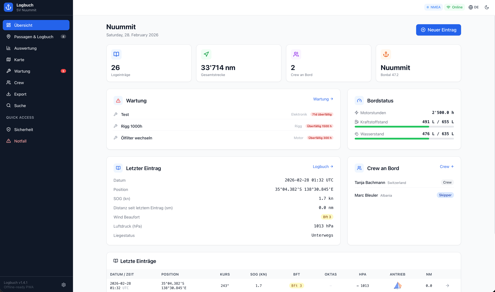
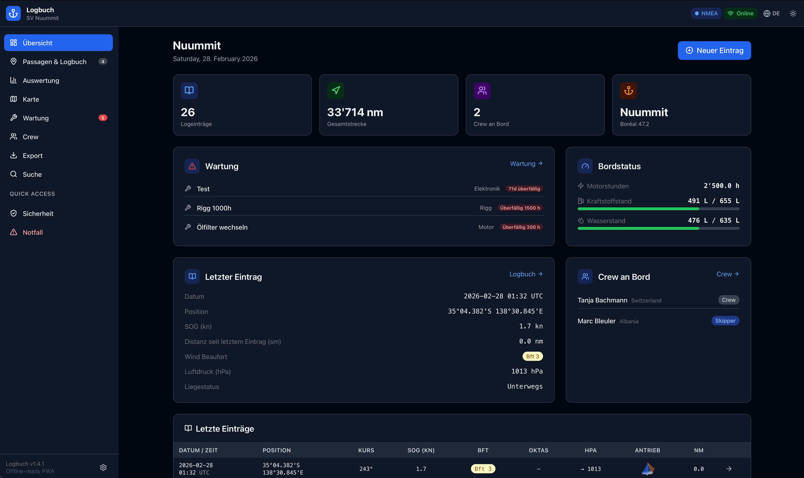
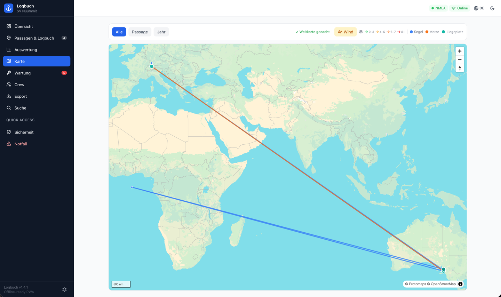
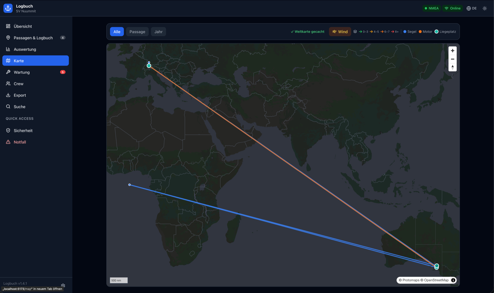
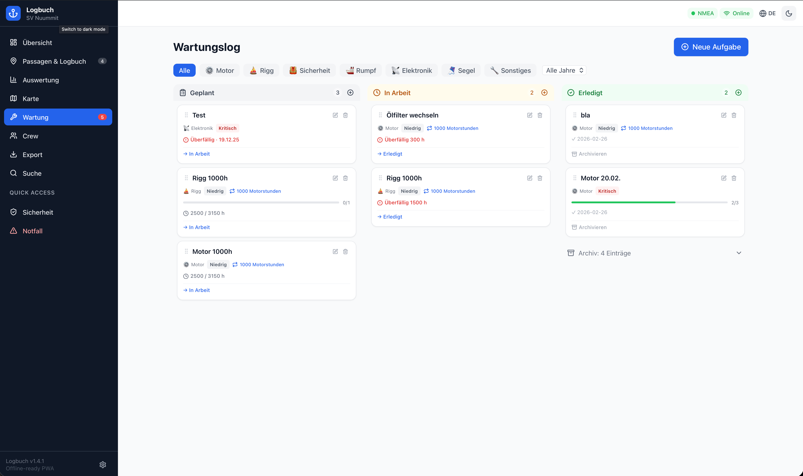
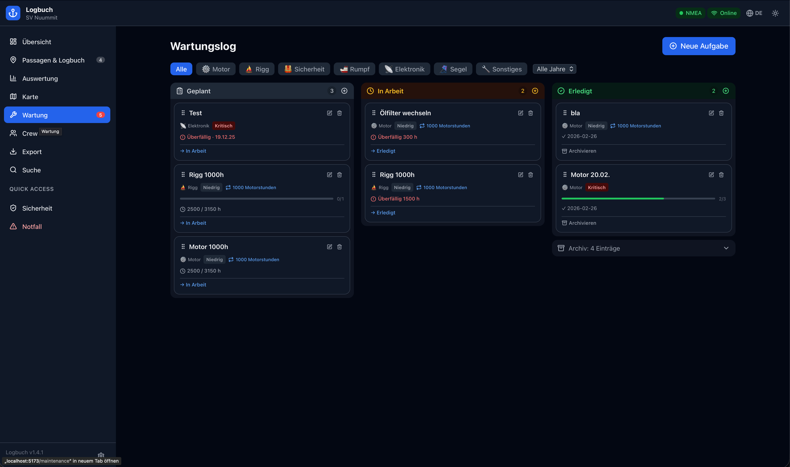
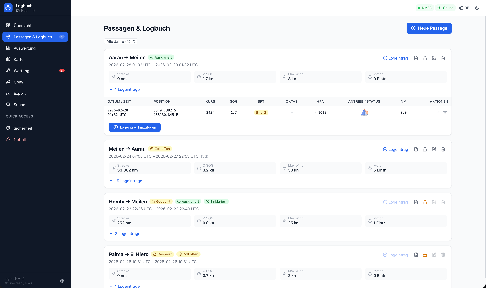
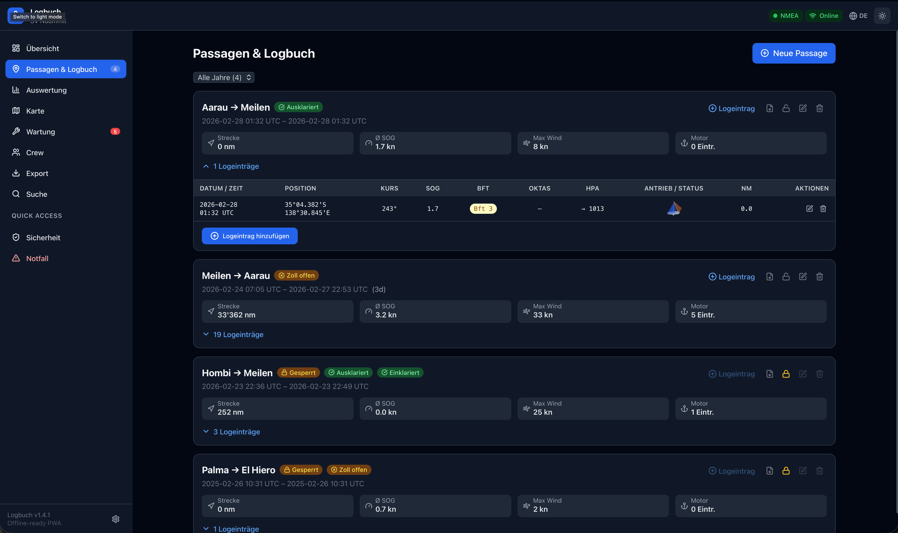
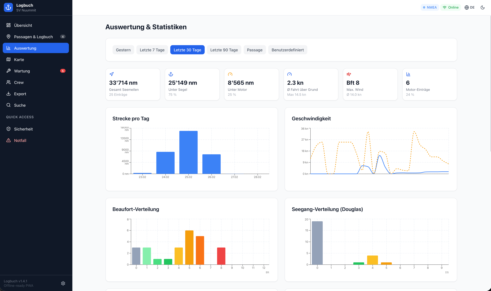
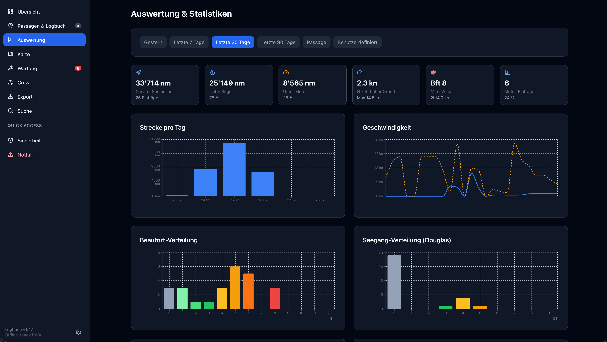

# Logbuch ⚓

**Digitales Segellogbuch — Desktop-App für macOS, Windows und Linux**

Logbuch ist ein vollständig offline-fähiges Segellogbuch ohne Server, ohne Cloud-Abo und ohne Internetverbindung. Alle Daten werden lokal gespeichert — auf dem Gerät, nicht irgendwo in der Cloud.

---

## Live-Demo

**[→ logbuch-demo.flowpro.io](https://flowpro.github.io/Logbook/)** — sofort im Browser ausprobieren, keine Installation nötig.

> Die Demo läuft als reine Browser-App (PWA) auf GitHub Pages. Datei-Upload und automatisches Backup sind dort deaktiviert. Für den vollen Funktionsumfang empfehlen wir die Desktop-App.

---

## Screenshots

<table>
  <tr>
    <td align="center"><b>Dashboard — Hell</b></td>
    <td align="center"><b>Dashboard — Dunkel</b></td>
  </tr>
  <tr>
    <td></td>
    <td></td>
  </tr>
  <tr>
    <td align="center"><b>Karte — Hell</b></td>
    <td align="center"><b>Karte — Dunkel</b></td>
  </tr>
  <tr>
    <td></td>
    <td></td>
  </tr>
  <tr>
    <td align="center"><b>Wartung / Kanban — Hell</b></td>
    <td align="center"><b>Wartung / Kanban — Dunkel</b></td>
  </tr>
  <tr>
    <td></td>
    <td></td>
  </tr>
  <tr>
    <td align="center"><b>Port Log — Hell</b></td>
    <td align="center"><b>Port Log — Dunkel</b></td>
  </tr>
  <tr>
    <td></td>
    <td></td>
  </tr>
  <tr>
    <td align="center"><b>Auswertung — Hell</b></td>
    <td align="center"><b>Auswertung — Dunkel</b></td>
  </tr>
  <tr>
    <td></td>
    <td></td>
  </tr>
</table>

---

## Features

- **Logeinträge** — Position, Kurs, Geschwindigkeit, Wind (Beaufort), Seegang, Barometer, Segelkonfiguration, Motor, Besatzung, Notizen
- **Passagen** — Port-to-Port-Verwaltung mit automatischer Datumssynchronisation aus Logeinträgen; Sperren nach Abschluss; PDF-Export je Passage
- **Wartung** — Kanban-Board (Geplant / In Arbeit / Erledigt) mit Drag & Drop, Prioritäten, Fälligkeiten, Checklisten je Aufgabe, wiederkehrende Aufgaben (täglich/wöchentlich/monatlich/jährlich/Motorstunden)
- **Besatzung** — Crewliste mit Qualifikationen, Passdaten, Bordzeiten
- **Statistiken** — Gesegelte Meilen, Windverteilung, Mooringstatus, Saisonübersicht
- **Karte** — Interaktive Karte aller Logbucheinträge mit GPS-Koordinaten, Routenlinien je Passage, Offline-Karte (Protomaps)
- **Suche** — Volltextsuche über alle Einträge mit Such-Operatoren (`port:`, `bft:`, `date:`, `crew:`)
- **PDF-Export** — Logbuch (A4 Querformat), Schiffsdossier, Besatzungsliste, Zollerklärung, Crew-Einweisungsprotokoll
- **NMEA-Bridge** — Liest Live-Daten vom Bordsystem (GPS, Wind, Log) via TCP/UDP und überträgt sie per WebSocket
- **Backup** — Automatisches tägliches Backup als ZIP; manueller Export/Import
- **Mehrsprachig** — Deutsch / Englisch
- **Dark Mode** — Systemeinstellung oder manuell

---

## Desktop-App installieren

Die einfachste Art, Logbuch zu nutzen: Installer herunterladen und starten — kein Node.js, kein Terminal, keine Entwicklungsumgebung nötig.

**[→ Zur Releases-Seite](https://github.com/FlowPro/Logbook/releases)**

| Betriebssystem | Datei | Beschreibung |
|----------------|-------|--------------|
| **Windows** | `.msi` | Windows Installer |
| **macOS** | `.dmg` | Disk Image — öffnen und App in Programme ziehen |
| **Linux** | `.AppImage` | Ausführbar machen (`chmod +x`) und starten |

> **Automatische Updates:** Die App prüft beim Start auf neue Versionen und bietet ein Update an.

---

### Sicherheitswarnung beim ersten Start

Die App ist nicht mit einem offiziellen Apple- oder Microsoft-Zertifikat signiert. Beim ersten Start erscheint eine Warnung — das ist normal.

**macOS** — Terminal öffnen und ausführen:
```bash
xattr -cr /Applications/Logbuch.app
```
Danach startet die App ohne weitere Meldungen. Alternativ: Rechtsklick auf App → Öffnen → Öffnen.

**Windows SmartScreen** — „Weitere Informationen" → „Trotzdem ausführen".

---

## NMEA-Bridge (optional)

Die NMEA-Bridge ist ein optionaler Dienst, der Live-Daten vom Bordsystem (GPS, Wind, Log) über TCP oder UDP empfängt und per WebSocket an die App weitergibt. In der Desktop-App startet die Bridge automatisch.

Konfiguration in der App unter **Einstellungen → NMEA-Integration** oder direkt in `server/config.json`:

```json
{
  "nmea": {
    "host": "192.168.1.100",
    "port": 10110,
    "protocol": "tcp"
  }
}
```

---

## Datensicherung

Alle Daten liegen **lokal auf dem Gerät** — kein Cloud-Sync. Beim Neustart oder Gerätewechsel ist ein Backup nötig.

- **Backup erstellen:** Einstellungen → Datensicherung → Jetzt sichern (ZIP-Datei)
- **Automatisches Backup:** Einstellungen → Datensicherung → Automatische Sicherung aktivieren (täglich beim ersten Öffnen)
- **Wiederherstellen:** Einstellungen → Datensicherung → Backup laden → ZIP auswählen

---

## PWA / Selbst-Hosting

Wer Logbuch auf einem eigenen Server hosten oder als PWA im Browser installieren möchte:

### Voraussetzungen

| Software | Version |
|----------|---------|
| **Node.js** | 20 oder 22 LTS |
| **npm** | wird mit Node.js mitgeliefert |

### Setup

```bash
git clone https://github.com/FlowPro/Logbook.git
cd Logbook
npm install
```

### Entwicklungsserver

```bash
npm run dev
# → http://localhost:5173
```

### Produktions-Build

```bash
npm run build    # Erzeugt dist/
npm run preview  # Lokaler Test auf http://localhost:4173
```

Den Inhalt von `dist/` auf einen beliebigen Webserver kopieren (Nginx, Apache, GitHub Pages). Über HTTPS kann die App als PWA im Browser installiert werden.

### Alle Befehle

| Befehl | Beschreibung |
|--------|-------------|
| `npm run dev` | Entwicklungsserver (hot reload) |
| `npm run build` | Produktions-Build |
| `npm run preview` | Fertigen Build lokal testen |
| `npm run server` | Nur NMEA-Bridge starten |
| `npm run dev:nmea` | App + NMEA-Bridge gleichzeitig |
| `npm run tauri:dev` | Desktop-App im Entwicklungsmodus |
| `npm run tauri:build` | Desktop-App für aktuelles OS bauen |

### Desktop-App selbst bauen

```bash
# Voraussetzungen: Node.js + Rust (rustup.rs)
npm install
npm run tauri:build
# Installer liegt unter src-tauri/target/release/bundle/
```

---

## Projektstruktur

```
logbuch/
├── src/
│   ├── components/     UI-Komponenten (Layout, Buttons, Formulare)
│   ├── db/             Datenbank-Schema (Dexie/IndexedDB) und Typen
│   ├── hooks/          React Hooks (Daten lesen/schreiben)
│   ├── i18n/           Übersetzungen (de.ts, en.ts)
│   ├── pages/          Alle Seiten der App
│   └── utils/          Hilfsfunktionen (PDF, Geo, Einheiten)
├── src-tauri/          Tauri Desktop-App (Rust + Konfiguration)
├── server/             NMEA-Bridge (optionaler Node.js-Dienst)
├── public/             Statische Assets (Icons, Manifest)
└── dist/               Produktions-Build (nach npm run build)
```

---

## Technologie

- [Tauri](https://tauri.app) — Desktop-App (Rust)
- [Vite](https://vitejs.dev) + [React 18](https://react.dev) + [TypeScript](https://www.typescriptlang.org)
- [Dexie.js](https://dexie.org) — IndexedDB
- [Tailwind CSS v3](https://tailwindcss.com)
- [MapLibre GL](https://maplibre.org) + [Protomaps](https://protomaps.com) — Karte
- [jsPDF](https://github.com/parallax/jsPDF) — PDF-Export
- [vite-plugin-pwa](https://vite-pwa-org.netlify.app) — PWA / Service Worker

---

## Haftungsausschluss

Logbuch wird ohne Gewährleistung und ohne Support bereitgestellt. Die App ist nicht für sicherheitskritische Navigation geeignet und ersetzt keine offiziellen Seekarten oder zugelassene Navigationssoftware. Datenverlust durch fehlende Backups liegt in der Verantwortung des Nutzers.

---

## Lizenz

Veröffentlicht unter der [MIT License](LICENSE).
